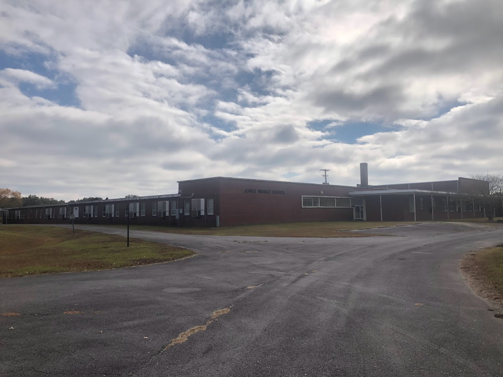

## Bio
I am a PhD Candidate in the Department of Sociology at Stanford University. I mostly work on issues related to spatial inequality, climate hazards, and schools. For my dissertation, I focus on my home state of North Carolina to explore how the changing climate influences spatial inequalities in educational opportunity through mechanisms such as unequal disruptions to schooling, differential rates of residential or school displacement, and uneven recoveries to natural disasters across places. I am a member of the [__Center for Education Policy Analysis__](https://cepa.stanford.edu/) and the [__Changing Cities Research Lab__](https://ccrl.stanford.edu/). 

## Research

#### Activities, Schools, and Segregation

Much of my research examines on spatial inequality in the twenty-first century. In [__a recent paper__](https://journals.sagepub.com/doi/10.1177/23780231251322006), I investigate whether _activity spaces_ -- the places where people work, recreate, worship, shop, etc. -- relate to school enrollments in Los Angeles, where school choice is prevalent. I find that families are more likely to enroll in schools near previous activities, and that segregating activities predict segregating school enrollments. In [__a review article__](https://www.annualreviews.org/content/journals/10.1146/annurev-soc-030420-014126), Jackelyn Hwang and I discuss scholarship on the persistence of racial residential segregation amidst neighborhood change. We outline three mechanisms that perpetuate these processes: resource inequalities, enduring ethnoracial hierarchies, and consolidated institutional power.

#### Climate Disasters and Spatial Inequalities in Education

My dissertation considers how climate disasters relate to spatial inequalities in education. Using statewide student records from North Carolina, fine-grain flooding information, and other demographic and geographic data, I look at the impacts of hurricane flooding on student mobility patterns through homes and schools, what these mean for broader patterns of segregation, and how repeated exposure to disasters affects academic progression.  

In a descriptive paper, I find a _loose coupling_ between flood risks in students' homes and schools. In other words, most students who experience flooding in one of these settings do not experience flooding in the other setting. This is likely driven by small-scale differences in geographic features, floodplain management, and land development. As students face increasing risks of disastrous flooding, this finding has implications for efforts to provide shelter and resources to affected populations. 

Next, I investigate student mobility in North Carolina following hurricane flooding and the implications for ethnoracial segregation in homes
and schools. While several studies have found that climate disasters are associated with demographic change, there is little empirical evidence of whether and how these events may be segregating forces in homes and schools. 

I also explore the effects of repeated climate hazards on academic outcomes. Two storms - Hurricanes Matthew and Florence - hit Eastern North Carolina in 2016 and 2018, respectively. Some students were affected by both storms, wh some were affected by only one. By comparing these students' attendance and learning outcomes over time, I measure potential ``cumulative disadvantages" of repeated exposure to climate hazards.   

In my final dissertation paper, I measure post-disaster school enrollment trajectories and compositional changes. For this analysis, I include schools outside of North Carolina, including those impacted by Hurricanes Sandy and Harvey, in order to assess broader disaster recovery trends. 

_A closed school in Jones County, NC (2022)_.

## Teaching
I designed and taught a course called [__Analytics for a Changing Climate: Introduction to Social Data Science__](https://bookdown.org/tylermc/soc128d/). The course introduces students to R and to data science more broadly, using examples from environmental justice and climate science. Please reach out if you would like to use any course materials or collaborate!

I have also served as a teaching assistant for several classes, including:
* Computational Social Science
* Economic Sociology
* Social Psychology
* Statistics

I regularly teach with the [__Stanford Jail and Prison Education Program__](https://sjpep.weebly.com/).

## Data and Materials

I wrote a helper function for loading Common Core Data from [__NCES' Elementary and Secondary Information System__](https://nces.ed.gov/ccd/elsi/). You can find the function [__here__](https://github.com/tylermcdaniel/tidy_elsi).

A replication package for my paper on activity spaces and school enrollments is available [__here__](https://purl.stanford.edu/sj315mc0440).

A replication package for descriptive analyses on metropolitan residential racial segregation between 1980-2020 is available [__here__](https://purl.stanford.edu/sy352sf3635).

